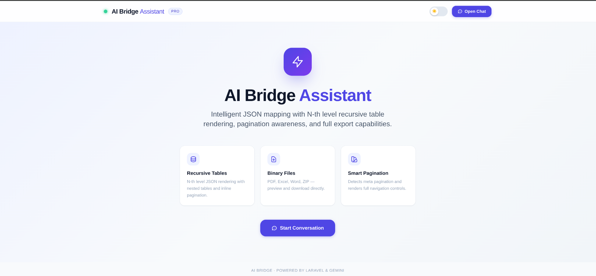
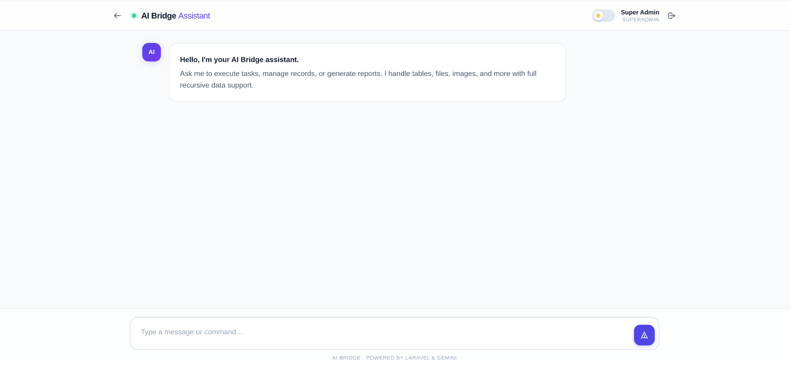
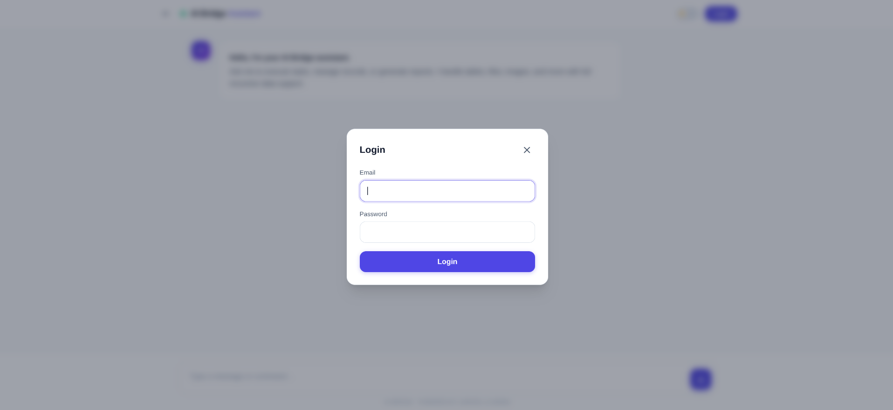

# Laravel AI Bridge

[](https://packagist.org/packages/sharifuddin/laravel-ai-bridge)
[](https://packagist.org/packages/sharifuddin/laravel-ai-bridge)
[](LICENSE)
[](https://php.net)
[](https://laravel.com)

A production-grade **Laravel AI orchestration package**. Laravel AI Bridge lets an LLM (Gemini, with a pluggable provider interface) discover the right application tool for a natural-language prompt via **hybrid semantic + lexical retrieval**, then executes it securely — with strict argument validation, Laravel-authorization re-checks, multi-tenant isolation, and aggressive token/cost caching.

---

## 🚀 Key Features

* **Hybrid tool retrieval** — query normalization → embedding → vector search → lexical scoring → permission/tenant filtering → ranked top-K → confidence/ambiguity detection. The AI model only ever sees the smallest useful set of tool declarations, never your whole tool catalog.
* **First-class `ToolInterface` tools** — define tools as small, testable classes (`AI::tool(ListUsersTool::class)`), mapped to your own Actions/Services — not directly to controllers.
* **Full backward compatibility** — existing controllers reflected via `ToolProviderInterface`/`CachedControllerToolProvider` keep working, now flowing through the same secure retrieval + execution pipeline via an automatic adapter.
* **Security first** — every tool call is re-validated and re-authorized (`Gate`/`$user->can()`) immediately before execution, even though retrieval already filtered by permission. AI tool-call output is never trusted as proof of authorization.
* **Multi-tenant isolation** — tools can declare `requiresTenant()`; a pluggable `TenantContextResolverInterface` lets your app supply the current company/branch/organization without the package assuming any specific tenancy package.
* **Pluggable vector store** — `VectorStoreInterface` with **PostgreSQL + pgvector as the default** (`AI_VECTOR_STORE=postgresql`), plus `mysql`, `mongodb`, `qdrant`, and `pinecone` as drop-in alternatives, and a dependency-free in-memory/cache-backed `ArrayVectorStore` fallback so the package works out of the box and degrades gracefully if the configured store is unavailable.
* **Token-efficient caching** — embeddings, retrieval results, and tool metadata are all cached via Laravel's cache abstraction, with keys safely namespaced by user/tenant so nothing leaks across accounts.
* **Bounded, normalized results** — tool output is truncated and shaped into `{success, data, meta}` before it ever reaches the AI or the HTTP response; large result sets never blow the context window.
* **Ready-to-use dual interfaces**: `POST /api/ai/prompt` (REST) and `GET /ai/assistant` (Copilot-style chat UI).

---

## ⚙️ Requirements

* **PHP:** `^8.1 | ^8.2 | ^8.3 | ^8.4`
* **Laravel:** `^9.0 | ^10.0 | ^11.0 | ^12.0`
* **Google Gemini API key** (chat + embeddings) from [Google AI Studio](https://aistudio.google.com/)
* *(Default vector store)*: PostgreSQL with the [`pgvector`](https://github.com/pgvector/pgvector) extension (`CREATE EXTENSION vector;`) — the store bootstraps its own table automatically on first use.
* *(Optional alternatives)*: `mysql` (stock MySQL/MariaDB, no extension needed), `mongodb` (requires `composer require mongodb/mongodb` + `ext-mongodb` + an Atlas Vector Search index), `qdrant`/`pinecone` (called over HTTP, no extra composer dependency). If the selected driver's dependencies/connection aren't available, the package automatically falls back to the built-in dependency-free `array` driver.

---

## 📦 Installation

### 1. Install via Composer

```bash
composer require sharifuddin/laravel-ai-bridge
```

### 2. Publish Configuration

```bash
php artisan vendor:publish --tag=ai-bridge-config
```

### 3. Configure Environment

Add the following to your `.env` file:


# For MYSQL

```env
GEMINI_API_KEY=''
AI_BRIDGE_EMBEDDING_DRIVER=gemini
AI_BRIDGE_EMBEDDING_MODEL=gemini-embedding-001

# Vector store (default: postgresql, via the pgvector extension on your
# existing Postgres connection). Switch drivers with a single env var:
# AI_VECTOR_STORE=postgresql   # default
AI_VECTOR_STORE=mysql
AI_BRIDGE_LEGACY_ENFORCE_PERMISSIONS=false
```

```env
GEMINI_API_KEY=your-gemini-api-key
AI_BRIDGE_EMBEDDING_DRIVER=gemini

# Vector store (default: postgresql, via the pgvector extension on your
# existing Postgres connection). Switch drivers with a single env var:
AI_VECTOR_STORE=postgresql   # default
# AI_VECTOR_STORE=mysql
# AI_VECTOR_STORE=mongodb
# AI_VECTOR_STORE=qdrant
# AI_VECTOR_STORE=pinecone
# AI_VECTOR_STORE=array      # dependency-free, local dev/testing only
```

### 4. Vector Store Architecture

```
VectorStoreInterface
        │
        ├── PostgreSQLVectorStore   ← default (pgvector)
        ├── MySQLVectorStore
        ├── MongoVectorStore
        ├── QdrantVectorStore
        ├── PineconeVectorStore
        └── ArrayVectorStore        ← dependency-free fallback
```

---

## 🧠 Defining a first-class tool

```php
namespace App\AiTools;

use Sharifuddin\LaravelAiBridge\Execution\ExecutionContext;
use Sharifuddin\LaravelAiBridge\Tools\AbstractTool;

class ListUsersTool extends AbstractTool
{
    public function name(): string { return 'list_users'; }

    public function category(): string { return 'users'; }

    public function description(): string
    {
        return 'List application users with pagination, search, status filtering and role filtering.';
    }

    public function parametersSchema(): array
    {
        return [
            'search'   => ['type' => 'string', 'required' => false, 'description' => 'Search by name or email'],
            'status'   => ['type' => 'string', 'required' => false, 'enum' => ['active', 'inactive']],
            'per_page' => ['type' => 'integer', 'required' => false, 'default' => 20, 'min' => 1, 'max' => 100],
        ];
    }

    public function permission(): ?string { return 'view-users'; }

    public function metadata(): array
    {
        return ['aliases' => ['users list', 'user list'], 'entity' => 'user', 'action' => 'list'];
    }

    public function execute(array $arguments, ExecutionContext $context): mixed
    {
        return app(\App\Services\UserService::class)->list($arguments, $context);
    }
}
```

Register it (e.g. in a service provider's `boot()`, or list it in `config/ai-bridge.php`):

```php
use Sharifuddin\LaravelAiBridge\Facades\AI;

AI::tool(\App\AiTools\ListUsersTool::class);
```

### Custom tool example for your own app

This is the pattern most apps use when they want AI to call their own business logic:

```php
<?php

namespace App\AiTools;

use Sharifuddin\LaravelAiBridge\Execution\ExecutionContext;
use Sharifuddin\LaravelAiBridge\Tools\AbstractTool;

class WeatherTool extends AbstractTool
{
    public function name(): string
    {
        return 'get_weather';
    }

    public function category(): string
    {
        return 'weather';
    }

    public function description(): string
    {
        return 'Get the current weather for a city using the app weather service.';
    }

    public function parametersSchema(): array
    {
        return [
            'city' => [
                'type' => 'string',
                'required' => true,
                'description' => 'City name, for example Dhaka or London',
            ],
            'unit' => [
                'type' => 'string',
                'required' => false,
                'enum' => ['celsius', 'fahrenheit'],
                'default' => 'celsius',
            ],
        ];
    }

    public function permission(): ?string
    {
        return null; // or 'view-weather' if you want to require authorization
    }

    public function metadata(): array
    {
        return [
            'aliases' => ['weather report', 'current weather', 'forecast'],
            'entity' => 'weather',
            'action' => 'lookup',
        ];
    }

    public function execute(array $arguments, ExecutionContext $context): mixed
    {
        $city = $arguments['city'];
        $unit = $arguments['unit'] ?? 'celsius';

        return app(\App\Services\WeatherService::class)->getForCity($city, $unit);
    }
}
```

And register it in a service provider:

```php
use Sharifuddin\LaravelAiBridge\Facades\AI;

public function boot(): void
{
    AI::tool(\App\AiTools\WeatherTool::class);
}
```

Then index and ask the assistant:

```bash
php artisan ai:tools:index
```

```json
POST /api/ai/prompt
{
  "prompt": "What is the weather in Dhaka today?"
}
```

The AI will only see the declarations for the tools that match the prompt, and it will execute the selected custom tool only after validation + re-authorization.

Index it into the vector store, then chat:

```bash
php artisan ai:tools:index
```

```
POST /api/ai/prompt
{"prompt": "Show me all active users"}
```

Behind the scenes: normalize → embed → vector search → hybrid rank → permission/tenant filter → send only the matching tool declarations to Gemini → validate its chosen arguments → re-authorize → execute → return a compact, bounded JSON result.

### Multi-tenant tools

```php
public function requiresTenant(): bool { return true; }
```

```php
// AppServiceProvider::register()
$this->app->bind(TenantContextResolverInterface::class, fn () =>
    new CallbackTenantContextResolver(fn () => auth()->user()
        ? ['company_id' => auth()->user()->company_id]
        : null
    )
);
```

---

## 🧩 Backward compatibility (legacy controller tools)

Controllers previously discovered via `ToolProviderInterface`/`CachedControllerToolProvider` (implementing the interface, or just reflected by public method) keep working with **zero changes**. They are wrapped as `LegacyControllerToolAdapter` instances and merged into the same registry, so they get the same semantic retrieval, argument validation, and authorization re-check as first-class tools. Disable this via `ai-bridge.legacy_controllers.enabled = false` once fully migrated.

The original `AiProcessorInterface` methods (`processPrompt()`, `selectRelevantTools()`) are preserved unchanged for any code calling them directly. `AiController` and the new `AiService::chat()` pipeline are what changed.

---

## ⚡ Artisan Commands

```bash
php artisan ai:tools:index                 # index new/changed tools (skips unchanged embeddings)
php artisan ai:tools:reindex                # force re-embed everything
php artisan ai:tools:reindex --tool=list_users
php artisan ai:tools:list                   # inspect the currently registered tools
```

---

## 🗂 Architecture

```
User → ChatRequest → QueryNormalizer → EmbeddingProvider → VectorStore
     → (semantic + lexical + metadata) hybrid scoring → permission/tenant filter
     → ranked top-K → confidence/ambiguity check → AiProvider (Gemini)
     → ArgumentValidator → re-authorization → ToolExecutor → your Action/Service
     → ToolResult (normalized, truncated) → AI → final response
```

Key interfaces (all in `Sharifuddin\LaravelAiBridge\Contracts`): `ToolInterface`, `ToolRegistryInterface`, `VectorStoreInterface`, `EmbeddingProviderInterface`, `AiProviderInterface`, `TenantContextResolverInterface`. Swap any implementation without touching the rest of the pipeline.

See `config/ai-bridge.php` for every tunable: retrieval weights/thresholds, cache TTLs, vector store connection, embedding driver, execution limits.

---

## 🔐 Security Model

* AI never decides authorization — Laravel does, twice: once at retrieval (so disallowed tools are never even shown to the model) and again immediately before execution.
* Arguments are whitelisted and validated against each tool's declared schema (types, `min`/`max`, `enum`) — an AI-supplied `per_page=999999` is rejected, not clamped silently.
* Only tools registered in the `ToolRegistry` can ever be executed — there is no arbitrary class/method invocation from AI-generated strings.
* Cache keys fold in a security fingerprint (user + tenant), so retrieval/embedding caches can never serve one user's/tenant's results to another.

---

## 💬 Chat UI






---

## 🧪 Testing

```bash
composer install
vendor/bin/phpunit
```

---

## 📄 License

This package is open-sourced software licensed under the [MIT license](LICENSE).

---

## 🤝 Contributing

Contributions are welcome! Please feel free to submit a Pull Request.

1. Fork the repository
2. Create your feature branch (`git checkout -b feature/AmazingFeature`)
3. Commit your changes (`git commit -m 'Add some AmazingFeature'`)
4. Push to the branch (`git push origin feature/AmazingFeature`)
5. Open a Pull Request

---

## 👨‍💻 Author

**Sharif Uddin**

- GitHub: [@sharifwebdev](https://github.com/sharifwebdev)
- Email: sharif.webpro@gmail.com
- Website: [https://sharifwebdev.github.io/](https://sharifwebdev.github.io/)

---

## 🌟 Support

If you find this package useful, please consider:

- ⭐ Starring the repository
- 🐛 Reporting issues
- 💡 Suggesting features
- 🔧 Submitting pull requests

---

## 📚 Changelog

Detailed changes for each release are documented in the [CHANGELOG.md](CHANGELOG.md).

---

## 🔗 Links

- [Packagist](https://packagist.org/packages/sharifuddin/laravel-ai-bridge)
- [GitHub Repository](https://github.com/sharifuddin/laravel-ai-bridge)
- [Issue Tracker](https://github.com/sharifuddin/laravel-ai-bridge/issues)
- [Documentation](https://github.com/sharifuddin/laravel-ai-bridge/wiki)

---

## 🎯 Quick Start Cheat Sheet

```bash
# 1. Install
composer require sharifuddin/laravel-ai-bridge

# 2. Publish config
php artisan vendor:publish --tag=ai-bridge-config

# 3. Add to .env
GEMINI_API_KEY=your-gemini-api-key
AI_BRIDGE_EMBEDDING_DRIVER=gemini
AI_VECTOR_STORE=postgresql

# 4. Define a tool
AI::tool(\App\AiTools\ListUsersTool::class);

# 5. Index tools
php artisan ai:tools:index

# 6. Chat via API
POST /api/ai/prompt
 "prompt": "Show me all active users"

# OR use the Chat UI
GET /ai/assistant
```

---

**Happy Building!** 🤖✨